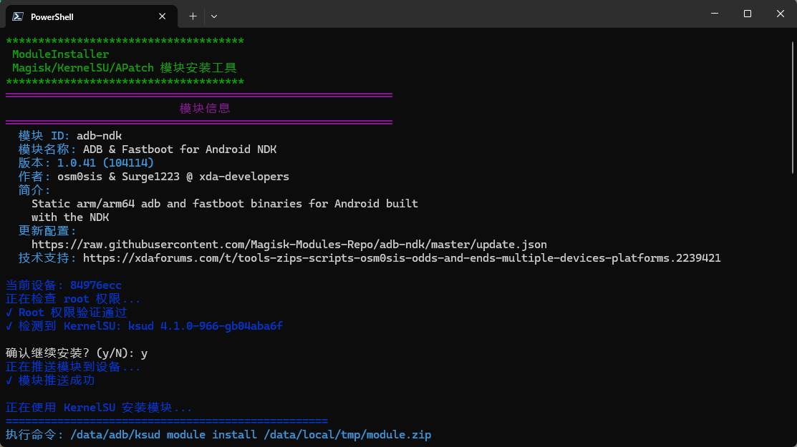

# ModuleInstaller

在PC端直接为Android设备安装Magisk/KernelSU/APatch模块，避免繁琐的复制和打开管理器安装的流程。



## 1、环境要求

- [Python3](https://www.python.org/downloads/)
- [platform-tools](https://developer.android.com/tools/releases/platform-tools)(包含adb,fastboot等工具)
- Android设备上已刷入[Magisk](https://github.com/topjohnwu/Magisk.git)/[KernelSU](https://github.com/tiann/KernelSU.git)/[APatch](https://github.com/bmax121/APatch.git)等ROOT方案(包括它们的分支在内)

## 2、使用方法

### 2.1、显示帮助信息

```bash
python ./ModuleInstaller.py
```

或

```bash
python ./ModuleInstaller.py -h
```

### 2.2、安装模块

#### 2.2.1、仅单个设备连接时

```bash
python ./ModuleInstaller.py <模块ZIP路径>
```

#### 2.2.2、多个设备连接时

先列出当前已连接设备(示例如下):

```bash
$ adb devices
List of devices attached
84976ecc        device
192.168.1.4:5555       device
```

然后

```bash
python ./ModuleInstaller.py <模块ZIP路径> -d <设备序列号>
```

比如:

```bash
python ./ModuleInstaller.py <模块ZIP路径> -d 192.168.1.4:5555
```

### 3、许可证

[MIT License](LICENSE)
